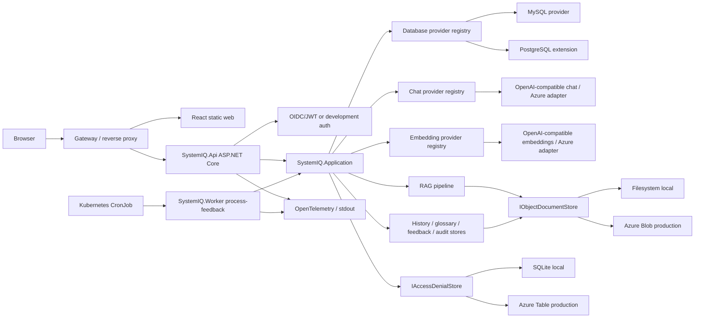
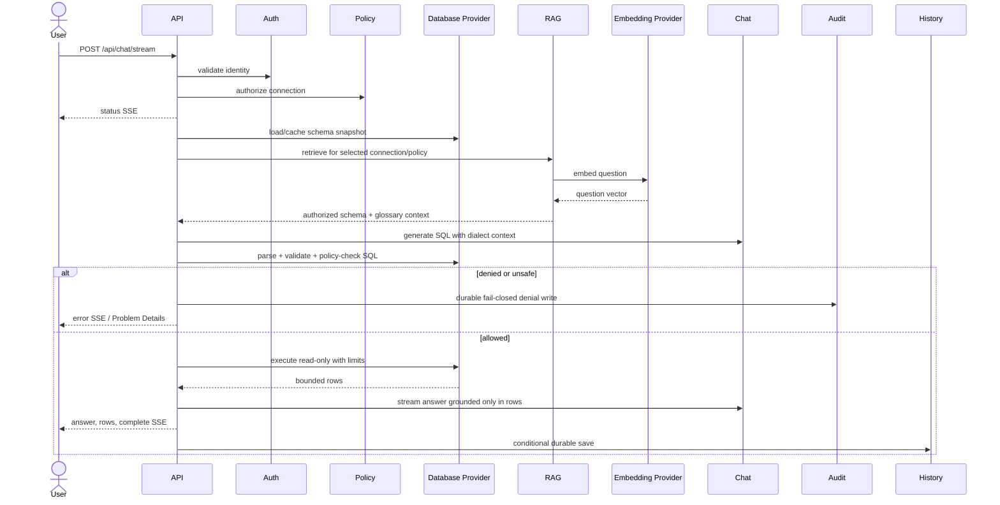
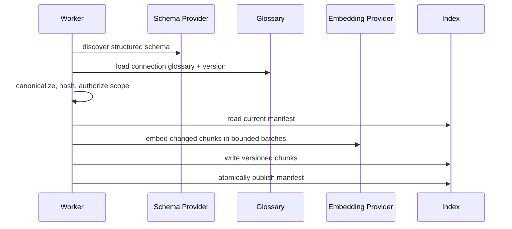
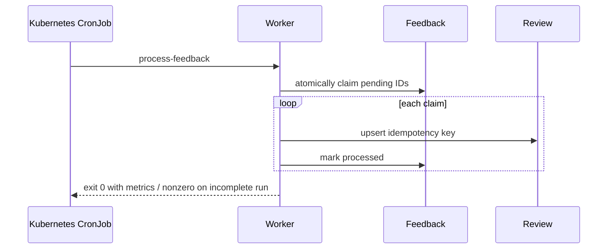

# SystemIQ Portable NL-to-SQL — Technical Requirements Document

## Executive Decision

SystemIQ will migrate from its Azure Functions/Azure SDK-shaped runtime to a standard ASP.NET Core API plus a one-shot worker command. Domain code will depend on provider-neutral contracts for object storage, denial state, relational databases, chat completion, embeddings, retrieval, identity, and secrets. MySQL is the first complete query-source provider. PostgreSQL extensibility is proven by a provider skeleton and conformance fixtures; full PostgreSQL product support is a later feature. Azure Blob Storage and Azure OpenAI remain optional production adapters. Local development uses filesystem object storage, SQLite denial state, MySQL, development authentication, and two independently configured OpenAI-compatible services: chat completion and text embeddings. Google Colab endpoints are allowed only in an explicitly non-production profile; `Qwen/Qwen3-Embedding-8B` is the approved development embedding baseline and is never a chat-model assumption or hard-coded domain rule.

Infrastructure portability is the first workstream, but Kubernetes-compatible architecture preparation is distinct from actual Kubernetes deployment. The existing Functions host remains deployable during parity testing, but the target Kubernetes architecture does not run Azure Functions. The portable runtime removes mandatory `AzureWebJobsStorage`; Kubernetes assets are gated until the ASP.NET Core application starts without mandatory Azure infrastructure, uses local portable state, connects to MySQL, exposes its required APIs, and passes the local smoke path.

## Inputs and Baseline

- Finalized product source: `PRD.md` v1.0.4 (`PRD-2026-001`, Implementation Ready, Readiness 4.88 PASS), 23 requirements and 81 acceptance criteria.
- Architecture evidence: `docs/local-infrastructure-gap-analysis.md` and `docs/kubernetes-feasibility.md`.
- Current code: React/Vite SPA; .NET 9 isolated Functions; Azure Blob/Table SDKs; Semantic Kernel Azure OpenAI registration; `Microsoft.Data.SqlClient`; raw environment JSON; MSAL/Entra-specific authentication.
- Current API contract: `docs/api-contract.md` and the client `ApiClient`.
- This is a brownfield host/provider extraction. Existing API behavior and persisted JSON are compatibility inputs, not the target architecture.

## Design Goals and Quality Targets

| Quality | Target |
|---|---|
| Local portability | P0 starts the real frontend/backend, exposes the permitted MySQL connection and discovered schema, and persists local state without Azure DNS calls, login, subscription, Storage, Key Vault, Azure SQL, Azure OpenAI, or Entra |
| API compatibility | Existing `/api` routes, status meanings, and SSE event names remain compatible during migration |
| Safety | Exactly one parsed read-only query; database account is read-only; 500-row and 30-second defaults remain configurable |
| Availability | Liveness never depends on AI/source DB; readiness has 2-second checks and a 5-second aggregate budget |
| Performance | Non-AI API p95 ≤500 ms locally; storage operation p95 ≤100 ms locally; chat first status event ≤1 s; targets exclude model/database execution |
| Limits | Question ≤4,000 chars; answer-result payload ≤5 MiB; rows default 500/max 5,000; SQL timeout default 30 s/max 120 s |
| Concurrency | Per-pod chat concurrency default 8; per-connection DB concurrency default 10; configurable without image rebuild |
| Reliability | Atomic local writes; optimistic concurrency for mutable documents; idempotent feedback processing |
| Security | No committed credentials; production development-auth startup is refused; audit denial writes fail closed |
| Observability | Structured redacted logs, W3C trace context, metrics/traces via OpenTelemetry; audit is not ordinary telemetry |

### Product delivery gates

- **P0 — portable infrastructure/database-ready application:** ASP.NET Core host/configuration foundation; filesystem durable state; SQLite denial state; working frontend/backend; configuration-driven MySQL catalog, access policy, and generic glossary; `GET /api/connections`; and MySQL schema discovery. P0 is Kubernetes-compatible preparation, not a Kubernetes deployment.
- **P1 — complete local AI/RAG NL-to-SQL:** independent chat and embedding providers; the Qwen3 embedding development baseline; connection/policy-scoped RAG; MySQL SQL generation and dialect-aware validation; read-only execution; actual rows; and a grounded answer through the real application.
- **P2 — Kubernetes/production portability:** only after P0/P1 evidence, add container/Helm deployment, ConfigMaps, injected Secrets, persistent external state, CronJob, probes, Gateway/SSE networking, graceful shutdown, concurrency/scaling controls, migration, and the PostgreSQL extension proof.

## Target Architecture



### Solution boundaries

| Project | Responsibility | Forbidden dependencies |
|---|---|---|
| `SystemIQ.Domain` | records, value objects, provider capability types, domain errors | Azure SDK, ASP.NET, ADO.NET provider packages |
| `SystemIQ.Application` | query orchestration, RAG, policy, glossary, feedback workflows | Functions attributes, concrete cloud/database clients |
| `SystemIQ.Infrastructure` | filesystem/Blob, SQLite/Table, MySQL, PostgreSQL, AI, secret adapters | HTTP endpoint behavior |
| `SystemIQ.Api` | ASP.NET routes, SSE, auth middleware, health, DI composition | provider-specific business branching |
| `SystemIQ.Worker` | one-shot commands such as `process-feedback` and `reindex-rag` | timer framework assumptions |
| `SystemIQ.Functions` | temporary compatibility adapter only | new domain behavior after extraction |

## Core Contracts and Data Design

### Storage

```csharp
public interface IObjectDocumentStore
{
    Task<Document<T>?> ReadAsync<T>(DocumentKey key, CancellationToken ct);
    Task<WriteResult> WriteAsync<T>(DocumentKey key, T value, WriteCondition condition, CancellationToken ct);
    Task<bool> DeleteAsync(DocumentKey key, string? expectedVersion, CancellationToken ct);
    IAsyncEnumerable<Document<T>> ListAsync<T>(DocumentPrefix prefix, CancellationToken ct);
}
```

`DocumentKey` contains validated namespace and slash-separated logical segments. It rejects rooted paths, `..`, empty segments, backslashes, control characters, Windows alternate streams, and decoded separator injection. Domain wrappers are `IChatHistoryStore`, `IGlossaryStore`, `IFeedbackStore`, `IAuditSink`, and `IRagIndexStore`; history, glossary, feedback, audit, and persisted RAG/index state use these provider-neutral boundaries and Azure concepts never cross them.

- Filesystem root: explicit absolute resolution under `Storage:FileSystem:Root`; write temp file in the same directory, flush, atomic replace; version is SHA-256 of content; audit uses create-new.
- Azure Blob: namespace maps to container; version is ETag; conditional writes use `IfMatch`/`IfNoneMatch`; managed identity or injected connection credential is adapter configuration.
- Mutable history/glossary/feedback updates retry a version conflict at most twice, then return 409. Audit never overwrites and never falls back to memory.
- Pod-local filesystem is valid only when `DeploymentMode=SingleProcessDevelopment`; validation rejects it for Kubernetes/multi-replica modes.
- Azurite is transitional compatibility/conformance tooling for the existing Azure adapters and is not required by the final local profile. MinIO/S3 is outside the current baseline unless a future deployment adds that provider explicitly.

`IAccessDenialStore` exposes `RecordAsync(subject, occurredAt)` and `GetWindowAsync(subject, since)`. SQLite uses WAL mode, a unique event ID, indexed subject/time, and retention cleanup. Azure Table remains an optional production adapter. It is not implemented through object storage.

### Configuration and secrets

Configuration binds through validated `IOptions` groups: `SystemIQ`/deployment mode, `Storage`, `DenialStore`, `DatabaseProviders`, `Connections`, `ConnectionCatalog`, `AccessPolicy`, `AI:Chat`, `AI:Embeddings`, `Rag`, `Auth`, `SqlSafety`, `Audit`, `Worker`, `Telemetry`, and `Health`. Chat and embedding provider, base URL, model ID, credential reference, timeout, and embedding dimensions/version values bind independently. Environment variables use .NET `__` nesting. `appsettings.Local.json.example` contains no secrets.

Connection metadata contains `{id, displayName, provider, credentialRef, options}`. `credentialRef` is resolved server-side by `ISecretResolver`; supported initial schemes are `config:<key>` and `file:<absolute-mounted-path>`. Production secret managers inject configuration or mounted files. Azure Key Vault references remain usable through hosting injection; application code does not require the Key Vault SDK. Secret values are wrapped as redaction-safe types and never serialized. Temporary Colab base URLs/tokens can be rotated through external configuration without application rebuild. Source, images, Git, Kubernetes YAML, logs, frontend runtime configuration, and health output never contain secret values.

Startup validation is profile-aware and accumulates all errors. `DevelopmentHeader` auth, filesystem persistence, SQLite denial state, and Colab providers are refused unless environment is Development and deployment mode is single-process. `/health/config` is curator-only and returns names/status, never values.

### Database providers

```csharp
public interface IDatabaseProvider
{
    string ProviderId { get; }
    DatabaseCapabilities Capabilities { get; }
    ISchemaIntrospector Schema { get; }
    ISqlDialect Dialect { get; }
    ISqlValidator Validator { get; }
    IReadOnlyQueryExecutor Executor { get; }
}
```

The registry rejects unknown IDs and duplicate registrations. A missing MySQL capability rejects the connection; it never falls back to SQL Server/Azure SQL discovery, dialect, validation, or execution. `SchemaSnapshot` includes provider/version, catalog/schema/table/column identifiers, native types, nullability, primary keys, foreign keys/relationships, snapshot hash, and captured time. Identifiers remain structured until dialect rendering.

- MySQL uses `MySqlConnector`, configurable non-secret connection metadata plus a server-side credential reference, and parameterized `information_schema` queries for tables, columns, primary keys, foreign keys, and relationships. It uses TLS options from the connection profile, command timeout/cancellation, and an explicit read-only transaction/session through a least-privilege account.
- PostgreSQL uses `Npgsql` when full support is enabled. In this TRD it must compile as an independently registered extension and pass contract fixtures without being enabled in the default product profile.
- `ISqlDialect` owns identifier quoting, qualified names, limits, parameter markers, date/function guidance, and prompt rules. The prompt never says Azure SQL unless the SQL Server provider is selected.

### SQL safety and execution

Safety is defense-in-depth:

1. Extract model output and require exactly one statement within size limits.
2. Parse through the selected dialect parser; parse failure blocks execution.
3. Permit query AST roots only (`SELECT`, `WITH` leading to query, supported set operations).
4. Reject `INSERT`, `UPDATE`, `DELETE`, `DROP`, `ALTER`, `CREATE`, `TRUNCATE`, multiple statements, unsafe procedures/execution paths, provider-specific mutations, MySQL `SELECT ... INTO/OUTFILE/DUMPFILE` and equivalent output/write constructs, locking clauses, unsafe functions, comments/directives used to alter interpretation, and policy-denied objects.
5. Apply a provider-specific row limit when safely rewritable; otherwise reject an unbounded query under strict mode.
6. Execute inside a read-only transaction/session using a read-only database account, timeout, cancellation, sequential reads, normalized value serialization, and bounded rows/bytes.

The selected parser is `SqlParserCS` stable version `0.6.5`, pinned through central package management. Its `MySqlDialect` and PostgreSQL dialect produce an in-process AST and support visitor-based statement/object inspection. SystemIQ wraps it behind `ISqlAstParser` so parser replacement does not affect policy or orchestration. Regex may be a pre-filter only, never the authorization boundary. Unsupported or ambiguous syntax is rejected; it never falls back to the current regex validator. The malicious/representative corpus is a release gate, and a material parser limitation must stop the PR and produce a replacement ADR. Source: [SqlParserCS repository](https://github.com/TylerBrinks/SqlParser-cs) and [stable NuGet package](https://www.nuget.org/packages/SqlParserCS/0.6.5).

### AI providers and Colab

```csharp
public interface IChatCompletionProvider
{
    Task<ChatCompletion> CompleteAsync(ChatRequest request, CancellationToken ct);
    IAsyncEnumerable<ChatDelta> StreamAsync(ChatRequest request, CancellationToken ct);
}
public interface IEmbeddingProvider
{
    int Dimensions { get; }
    Task<IReadOnlyList<EmbeddingVector>> EmbedAsync(IReadOnlyList<string> input, CancellationToken ct);
}
```

Separate registries select named chat and embedding profiles independently; neither registry derives provider, base URL, model, credential, timeout, or lifecycle from the other. Requests carry model ID, bounded input/messages, correlation ID, timeout, and cancellation. Provider exceptions map to normalized categories: authentication, quota/rate, timeout, unavailable, invalid response, and policy.

- Chat completion uses `POST /v1/chat/completions` for grounded reasoning, SQL generation, and final-answer generation. The development baseline is a configurable temporary Google Colab/OpenAI-compatible provider. Its exact Qwen chat model ID is external/pending and does not block provider implementation.
- Text embeddings use `POST /v1/embeddings` for question, schema, and glossary embeddings. The development profile sets `Model=Qwen/Qwen3-Embedding-8B`; this is a RAG embedding model only, never the chat model, and remains replaceable configuration rather than application/domain logic.
- Azure OpenAI chat and embedding adapters wrap the supported Semantic Kernel/Azure connectors and can be registered independently with managed identity or injected keys.
- OpenAI-compatible chat and embedding adapters are independently instantiated and mock-testable before live Colab access. Colab requires Development, hostname allowlists, TLS, short timeouts, no automatic credential logging, and a prominent non-production health label. No ngrok/tunnel/Colab URL or credential is committed. Colab unavailability returns dependency-unavailable; it never triggers unsafe fallback.

Approved temporary development topology:

```text
SystemIQ
  |
  +--> Colab Chat Service
  |      POST /v1/chat/completions
  |
  +--> Colab Embedding Service
         POST /v1/embeddings
         Model: Qwen/Qwen3-Embedding-8B
```

The services may use separate notebooks, runtimes, accounts, URLs, models, credentials, and timeouts. Only synthetic, de-identified, or explicitly approved data may be sent to Colab; Colab is Development/Test only.

### RAG and glossary

Schema and glossary records are canonicalized into connection-scoped chunks for table descriptions, column descriptions, PK/FK relationships, relationship/join hints, business terms, and synonyms. Each chunk/manifest records `chunkId`, connection ID, source type, schema snapshot version/hash, glossary version, text/content hash, embedding provider/profile/model, embedding dimension, content version, index version, vector, and metadata. `reindex-rag` embeds only changed chunks and atomically publishes a versioned manifest.

Query retrieval sends the natural-language question to the selected `IEmbeddingProvider`, filters candidates by selected connection and authorized tables/columns/objects before ranking, computes cosine similarity, takes configurable top-K/default 12, applies token budget, and merges exact glossary/synonym matches ahead of semantic matches. Only this authorized schema/glossary context reaches `IChatCompletionProvider` for dialect-correct SQL. A model, dimension, schema, glossary, content, or index compatibility change marks the index stale and requires/reports re-indexing.

Development may explicitly select `LexicalOnly`; the response/telemetry marks degraded retrieval. Production defaults to fail closed for missing required embeddings. No cross-connection vector search is permitted.

### API and authentication

Existing routes and SSE events (`status`, `answer`, `rows`, `complete`, `error`) remain. In the P0 local profile, `GET /api/connections` reads the configuration-driven `ConnectionCatalog` plus current `AccessPolicy` and returns permitted non-secret MySQL metadata without Entra, Azure Storage, Key Vault, Azure SQL, or Azure OpenAI. New endpoints are `GET /api/health/live`, `/ready`, `/startup`; `GET /api/health/config` (curator); and one-shot worker commands, not public scheduling endpoints. Errors use RFC 7807 Problem Details with correlation ID and stable error code. The SSE response sends an initial status within one second, disables proxy buffering, flushes each frame, propagates disconnect cancellation, and persists a successful assistant turn only after completion.

ASP.NET `AddJwtBearer` uses configurable authority, audience, role claim, subject claim, and clock skew. Entra remains supported as OIDC. The SPA gains an auth adapter and runtime `/config.js`; MSAL may implement the Entra adapter. Development-header auth is registered only under the guarded local profile and uses fixed configured identities, not arbitrary production headers.

### Logging, health, and deployment

Structured logs contain timestamp, level, event ID, trace/correlation ID, route, connection ID, provider IDs, durations, row count, and outcome. They exclude credentials, tokens, prompts/questions by default, raw SQL, rows, answers, and embedding vectors. Audit remains a separate durable sink. OpenTelemetry exports are optional; stdout always works.

Liveness checks process responsiveness only. Startup checks configuration initialization. Readiness checks configuration, writable internal state, denial store, and loaded provider registrations; AI/source-database status appears as detailed dependency health and metrics but does not restart every pod.

Images run non-root with read-only root filesystem and temporary writable mount. Kubernetes work is blocked until the portable ASP.NET Core application starts, uses non-Azure/local storage, connects to MySQL, exposes required APIs, and passes the P0/P1 local smoke evidence. Kubernetes then uses web/API Deployments, Services, Gateway routes, ConfigMaps, externally delivered/mounted Secrets, persistent external storage, default-deny NetworkPolicies, startup/readiness/liveness probes, graceful shutdown, HPA, PDB, topology spread, and a one-shot-worker `CronJob` with `concurrencyPolicy: Forbid`. The API is stateless; pod-local filesystem is rejected for durable multi-replica state. Helm packages in-cluster resources; OpenTofu/Terraform is outside this TRD for cluster/cloud provisioning.

## Runtime Sequences

### Natural-language query



### RAG indexing



### Feedback CronJob



## Migration Strategy

1. Capture existing API/SSE/security behavior in host-independent contract tests and extract Domain/Application boundaries without changing Functions routes.
2. **P0 foundation:** add the ASP.NET Core composition root, typed external configuration/secrets, provider contracts, filesystem/SQLite local state, and keep Azure adapters only as compatibility implementations.
3. **P0 database-ready checkpoint:** add the configuration-driven local catalog/policy/glossary plus MySQL provider, schema discovery, dialect/safety, read-only execution, and permitted `GET /api/connections`; verify the real frontend/backend without mandatory Azure infrastructure.
4. **P1 AI/RAG:** add independent chat/embedding registries, mock-tested OpenAI-compatible protocols, the configurable `Qwen/Qwen3-Embedding-8B` development embedding profile, versioned RAG, and complete MySQL orchestration.
5. Complete ASP.NET Core API/auth/SSE and one-shot worker parity, then pass the fifteen-step real local stakeholder milestone; canned/demo answers fail this gate.
6. Migrate Blob JSON with a versioned, resumable tool: inventory/count/hash → transform → write conditionally → verify → produce manifest. Audit retention is never shortened. No dual write occurs without an explicit consistency design.
7. **P2 only after P0/P1 evidence:** add Kubernetes/Helm resources, canary the ASP.NET host, disable the Functions timer before enabling CronJob, observe, and retain rollback routing.
8. After parity/security/data verification, retire Functions and mandatory `AzureWebJobsStorage`; complete production promotion and PostgreSQL extension proof.

Rollback is application-image and traffic rollback while old state remains readable. Any irreversible schema/data migration requires backup plus verified restoration. Migration commands default to dry-run and require explicit target/provider arguments.

## Dependency Dispositions

| ID | Disposition | Technical treatment |
|---|---|---|
| D-01 | **BASELINED FOR IMPLEMENTATION** | MySQL is first. Local version, synthetic test schema, and read-only credentials are runtime/environment configuration. |
| D-02 | **BASELINED FOR IMPLEMENTATION; model ID external/pending** | Implement the independently configured Colab/OpenAI-compatible chat provider and mock protocol now; do not invent or block on the exact Qwen chat model ID. |
| D-03 | **BASELINED FOR IMPLEMENTATION** | Use configurable `Qwen/Qwen3-Embedding-8B` through `POST /v1/embeddings` for the development embedding baseline. |
| D-04 | **CLOSED PRODUCT DECISION** | Filesystem is local durable application storage; SQLite is local denial state. |
| D-05 | **BASELINED FOR IMPLEMENTATION** | `ConnectionCatalog` and `AccessPolicy` are generic configuration and must cover the local MySQL connection. |
| D-06 | **BASELINED FOR IMPLEMENTATION** | ASP.NET Core API plus one-shot worker is the target; Functions is compatibility/parity only. |
| D-07 | **EXTERNAL/PENDING before P2** | Platform ownership/standards are required before Kubernetes deployment. |
| D-08 | **EXTERNAL/PENDING before production** | Deployment compliance, retention, residency, backup, and review ownership gate production only. |
| D-09 | **AFTER MYSQL BASELINE** | PostgreSQL details remain additive and do not delay the MySQL path. |
| D-10 | **EXTERNAL/PENDING for live Colab** | Live validation needs Colab access/handoff rules; mock OpenAI-compatible testing proceeds without a live URL. |

## Master Task List

### PR 1: Portable host, configuration, and secret foundations
**Shippable State:** A developer can start the containerized ASP.NET Core API, use guarded development identity, and see actionable startup/readiness status without Azure configuration.

#### TRD-001: Create Domain/Application/Infrastructure/API/Worker project boundaries [satisfies REQ-015, REQ-023]
- Estimate: 6h
- Deliver contracts and dependency-rule checks described above; keep Functions compiling as adapter.
#### TRD-001-TEST: Verify project dependency rules and dual-host build [verifies TRD-001] [depends: TRD-001] [satisfies REQ-015, REQ-023]
- Estimate: 3h
- Validates PRD ACs: AC-015-1, AC-023-1

#### TRD-002: Implement typed options, profile validation, and redacted configuration diagnostics [satisfies REQ-002, REQ-015, REQ-022] [depends: TRD-001]
- Estimate: 7h
- Implement all documented storage, denial, database, catalog, policy, chat, embedding, auth, deployment, health, audit, worker, and telemetry option groups; accumulate errors and enforce provider/deployment capability rules.
#### TRD-002-TEST: Test valid/invalid profile matrices and redaction [verifies TRD-002] [depends: TRD-002] [satisfies REQ-002, REQ-015, REQ-022]
- Estimate: 4h
- Validates PRD ACs: AC-002-3, AC-015-3, AC-022-1, AC-022-4

#### TRD-003: Implement configuration/file secret resolution and redaction-safe values [satisfies REQ-012, REQ-022] [depends: TRD-002]
- Estimate: 5h
- Refuse relative secret files, client exposure, missing values, and secret serialization.
#### TRD-003-TEST: Test secret sources, rotation reload policy, and leak corpus [verifies TRD-003] [depends: TRD-003] [satisfies REQ-012, REQ-022]
- Estimate: 3h
- Validates PRD ACs: AC-012-2, AC-022-2, AC-022-3

#### TRD-004: Add ASP.NET Core composition root, health endpoints, and hardened image [satisfies REQ-023] [depends: TRD-001, TRD-002]
- Estimate: 7h
- Implement startup/live/ready semantics, shutdown, non-root image, limits, and Problem Details.
#### TRD-004-TEST: Container and health behavior tests [verifies TRD-004] [depends: TRD-004] [satisfies REQ-023]
- Estimate: 4h
- Validates PRD ACs: AC-023-3, AC-023-5

#### TRD-005: Add SPA runtime configuration and authentication adapter seam [satisfies REQ-002, REQ-022, REQ-023] [depends: TRD-002]
- Estimate: 6h
- Preserve relative API paths; keep an Entra/MSAL adapter and guarded development adapter.
#### TRD-005-TEST: Test one web image across local/OIDC configurations [verifies TRD-005] [depends: TRD-005] [satisfies REQ-002, REQ-022, REQ-023]
- Estimate: 3h
- Validates PRD ACs: AC-002-1, AC-002-2, AC-022-2, AC-023-1

**PR 1 total: 10 tasks, 48h**

### PR 2: Portable durable state
**Shippable State:** A local user can persist isolated history, glossary, feedback, audit, and denial windows across restarts without Azurite; production can select Azure adapters through the same contracts.

#### TRD-006: Define object/domain store contracts and conformance harness [satisfies REQ-004, REQ-005, REQ-007, REQ-009, REQ-016] [depends: TRD-001]
- Estimate: 6h
#### TRD-006-TEST: Run contract tests against an in-test reference provider [verifies TRD-006] [depends: TRD-006] [satisfies REQ-004, REQ-005, REQ-007, REQ-009, REQ-016]
- Estimate: 3h
- Validates PRD ACs: AC-004-1, AC-005-2, AC-007-2, AC-009-2, AC-016-3

#### TRD-007: Implement safe atomic filesystem document provider [satisfies REQ-009, REQ-015, REQ-016] [depends: TRD-006, TRD-002]
- Estimate: 7h
#### TRD-007-TEST: Test traversal, atomicity, conflicts, restart, corruption, and outage [verifies TRD-007] [depends: TRD-007] [satisfies REQ-009, REQ-015, REQ-016]
- Estimate: 4h
- Validates PRD ACs: AC-009-3, AC-015-1, AC-016-1, AC-016-3, AC-016-4

#### TRD-008: Implement Azure Blob document provider with conditional writes [satisfies REQ-016, REQ-022] [depends: TRD-006]
- Estimate: 7h
#### TRD-008-TEST: Run provider conformance suite against Azurite and gated Azure integration [verifies TRD-008] [depends: TRD-008] [satisfies REQ-016, REQ-022]
- Estimate: 4h
- Validates PRD ACs: AC-016-2, AC-016-3, AC-022-3

#### TRD-009: Implement history, glossary, feedback, audit, and RAG store adapters [satisfies REQ-004, REQ-005, REQ-006, REQ-007, REQ-009, REQ-021] [depends: TRD-006]
- Estimate: 7h
- Route history, generic glossary, feedback, audit, and persisted RAG chunks/manifests through domain/provider contracts with connection isolation and no healthcare defaults.
#### TRD-009-TEST: Test isolation, optimistic concurrency, idempotency, and fail-closed audit [verifies TRD-009] [depends: TRD-009] [satisfies REQ-004, REQ-005, REQ-006, REQ-007, REQ-009, REQ-021]
- Estimate: 4h
- Validates PRD ACs: AC-004-1, AC-004-2, AC-005-1, AC-005-2, AC-006-3, AC-007-2, AC-007-3, AC-009-1, AC-009-2, AC-016-5

#### TRD-010: Define denial-store contract and implement SQLite provider [satisfies REQ-010, REQ-015, REQ-016] [depends: TRD-002]
- Estimate: 6h
#### TRD-010-TEST: Test rolling windows, concurrency, restart, retention, and clock boundaries [verifies TRD-010] [depends: TRD-010] [satisfies REQ-010, REQ-015, REQ-016]
- Estimate: 4h
- Validates PRD ACs: AC-010-1, AC-010-2, AC-015-1

#### TRD-011: Adapt Azure Table denial storage behind the contract [satisfies REQ-010, REQ-016, REQ-022] [depends: TRD-010]
- Estimate: 5h
#### TRD-011-TEST: Compare SQLite/Table denial-store conformance [verifies TRD-011] [depends: TRD-011] [satisfies REQ-010, REQ-016, REQ-022]
- Estimate: 3h
- Validates PRD ACs: AC-010-1, AC-016-3, AC-022-3

**PR 2 total: 12 tasks, 60h**

### PR 3: Database portability and MySQL safety
**Shippable State:** P0 database-ready checkpoint: the real local frontend/backend starts without mandatory Azure services, `GET /api/connections` exposes the permitted non-secret MySQL connection, its schema is discoverable, and only bounded dialect-validated read-only queries can execute.

#### TRD-012: Implement connection catalog/policy, database provider registry, P0 connections API, and capability contracts [satisfies REQ-002, REQ-008, REQ-017, REQ-019, REQ-022] [depends: TRD-002, TRD-003]
- Estimate: 6h
- Deliver a generic configuration-driven local MySQL catalog/access policy and non-secret `GET /api/connections`; reject unknown/missing capabilities without SQL Server/Azure SQL fallback.
#### TRD-012-TEST: Test registration, local MySQL visibility, policy filtering, credential redaction, secret resolution, and capability rejection [verifies TRD-012] [depends: TRD-012] [satisfies REQ-002, REQ-008, REQ-017, REQ-019, REQ-022]
- Estimate: 3h
- Validates PRD ACs: AC-002-1, AC-002-3, AC-002-4, AC-008-3, AC-017-2, AC-017-3, AC-019-1

#### TRD-013: Implement MySQL connection and schema introspection [satisfies REQ-005, REQ-017, REQ-018] [depends: TRD-012]
- Estimate: 7h
- Use `MySqlConnector` plus parameterized `information_schema` discovery for tables, columns, PKs, FKs, and relationships through a configured least-privilege credential reference.
#### TRD-013-TEST: MySQL container tests for schema, keys, TLS modes, cancellation, and permissions [verifies TRD-013] [depends: TRD-013] [satisfies REQ-005, REQ-017, REQ-018]
- Estimate: 4h
- Validates PRD ACs: AC-005-3, AC-017-1, AC-018-1

#### TRD-014: Implement MySQL dialect rendering and prompt guidance [satisfies REQ-001, REQ-014, REQ-017, REQ-018] [depends: TRD-012]
- Estimate: 6h
- Own MySQL identifier quoting, qualified names, date/function guidance, joins, parameter markers, and row-limit rendering without SQL Server fallback.
#### TRD-014-TEST: Golden tests for identifiers, limits, joins, dates, functions, and prompt isolation [verifies TRD-014] [depends: TRD-014] [satisfies REQ-001, REQ-014, REQ-017, REQ-018]
- Estimate: 4h
- Validates PRD ACs: AC-001-1, AC-014-1, AC-017-1, AC-018-2

#### TRD-015: Integrate pinned SqlParserCS and implement dialect-aware SQL safety/policy pipeline [satisfies REQ-008, REQ-009, REQ-014, REQ-017, REQ-018] [depends: TRD-012, TRD-014]
- Estimate: 7h
- Use `SqlParserCS` 0.6.5 through `ISqlAstParser`; stop on corpus-gate failure and never fall back to regex. Emit structured object references for policy.
#### TRD-015-TEST: Run benign/malicious MySQL corpus and authorization cases [verifies TRD-015] [depends: TRD-015] [satisfies REQ-008, REQ-009, REQ-014, REQ-017, REQ-018]
- Estimate: 5h
- Validates PRD ACs: AC-008-1, AC-008-2, AC-009-1, AC-014-1, AC-014-2, AC-014-4, AC-018-3

#### TRD-016: Implement bounded MySQL read-only executor [satisfies REQ-001, REQ-011, REQ-014, REQ-017, REQ-018] [depends: TRD-013, TRD-015]
- Estimate: 6h
- Enforce provider row/byte limits, timeout, propagated cancellation, explicit read-only session/transaction behavior, and least-privilege credentials.
#### TRD-016-TEST: Execute read/write, timeout, cancellation, row/byte, and type-normalization scenarios [verifies TRD-016] [depends: TRD-016] [satisfies REQ-001, REQ-011, REQ-014, REQ-017, REQ-018]
- Estimate: 4h
- Validates PRD ACs: AC-001-1, AC-001-2, AC-001-3, AC-011-3, AC-014-3, AC-014-4, AC-018-2, AC-018-3, AC-018-4

**PR 3 total: 10 tasks, 52h**

### PR 4: AI providers, embeddings, and RAG
**Shippable State:** Independent chat and embedding services—including the configurable Qwen3 embedding development profile—produce dialect-correct MySQL SQL from connection/policy-scoped schema and generic glossary context; Azure adapters remain independently selectable.

#### TRD-017: Define chat/embedding contracts, registries, errors, budgets, and evaluation harness [satisfies REQ-011, REQ-013, REQ-020, REQ-021] [depends: TRD-002]
- Estimate: 6h
- Keep `IChatCompletionProvider` and `IEmbeddingProvider`, registries, profiles, base URLs, models, credentials, timeouts, and lifecycles independent.
#### TRD-017-TEST: Provider conformance tests for cancellation, streaming, dimensions, errors, and redaction [verifies TRD-017] [depends: TRD-017] [satisfies REQ-011, REQ-013, REQ-020, REQ-021]
- Estimate: 3h
- Validates PRD ACs: AC-011-1, AC-011-3, AC-013-1, AC-020-1, AC-020-4, AC-020-5, AC-021-1, AC-021-3

#### TRD-018: Implement Azure OpenAI chat and embedding adapters [satisfies REQ-020, REQ-021, REQ-022] [depends: TRD-017, TRD-003]
- Estimate: 7h
#### TRD-018-TEST: Gated Azure adapter contract/evaluation tests with managed identity and key modes [verifies TRD-018] [depends: TRD-018] [satisfies REQ-020, REQ-021, REQ-022]
- Estimate: 4h
- Validates PRD ACs: AC-020-2, AC-021-1, AC-021-3, AC-022-2

#### TRD-019: Implement independent OpenAI-compatible chat/embedding adapters, Qwen3 development profile, and Colab guardrails [satisfies REQ-012, REQ-015, REQ-020, REQ-021, REQ-022] [depends: TRD-017, TRD-003]
- Estimate: 7h
- Implement separate `POST /v1/chat/completions` and `POST /v1/embeddings` clients; configure `Qwen/Qwen3-Embedding-8B` only in the development embedding profile and leave the exact chat model external/pending.
#### TRD-019-TEST: Mock independent-host/protocol/credential tests plus opt-in Colab/Qwen3 smoke and rotation tests [verifies TRD-019] [depends: TRD-019] [satisfies REQ-012, REQ-015, REQ-020, REQ-021, REQ-022]
- Estimate: 5h
- Validates PRD ACs: AC-012-3, AC-015-2, AC-020-3, AC-020-4, AC-020-5, AC-021-1, AC-021-2, AC-021-3, AC-022-2, AC-022-5

#### TRD-020: Implement versioned RAG indexing/metadata, authorized retrieval, ranking, and lexical degradation [satisfies REQ-005, REQ-008, REQ-021] [depends: TRD-009, TRD-013, TRD-017]
- Estimate: 7h
- Index table/column descriptions, PK/FK relationships, join hints, generic terms/synonyms, and required connection/schema/glossary/model/dimension/content/index version metadata; filter connection and authorized objects before ranking/context assembly.
#### TRD-020-TEST: Test connection/object isolation, metadata, compatibility staleness, re-indexing, top-K, token budget, exact-term boost, and degraded mode [verifies TRD-020] [depends: TRD-020] [satisfies REQ-005, REQ-008, REQ-021]
- Estimate: 4h
- Validates PRD ACs: AC-005-1, AC-005-2, AC-005-3, AC-008-1, AC-021-1, AC-021-4, AC-021-5, AC-021-6

#### TRD-021: Refactor query orchestration to use database, RAG, and AI contracts [satisfies REQ-001, REQ-004, REQ-005, REQ-011, REQ-013, REQ-020, REQ-021] [depends: TRD-014, TRD-016, TRD-017, TRD-020]
- Estimate: 7h
- Execute the required question-embedding → authorized connection-scoped retrieval → chat SQL generation → AST/policy validation → read-only MySQL rows → grounded-answer flow without canned output.
#### TRD-021-TEST: End-to-end orchestrator tests for results, no-results, failure isolation, history, and evaluation metadata [verifies TRD-021] [depends: TRD-021] [satisfies REQ-001, REQ-004, REQ-005, REQ-011, REQ-013, REQ-020, REQ-021]
- Estimate: 5h
- Validates PRD ACs: AC-001-1, AC-001-2, AC-001-3, AC-004-3, AC-011-1, AC-011-2, AC-011-3, AC-013-1, AC-013-2, AC-020-4, AC-021-4

**PR 4 total: 10 tasks, 55h**

### PR 5: API, authentication, background workflow, and observability
**Shippable State:** P1 checkpoint: the real React/ASP.NET application completes the independently configured Qwen3-backed RAG-to-read-only-MySQL journey and returns actual rows plus a grounded answer, while auth, streaming, curation, feedback, audit/rate limiting, and observability remain contract-compatible.

#### TRD-022: Migrate user/admin routes and SSE to ASP.NET Core [satisfies REQ-001, REQ-002, REQ-003, REQ-004, REQ-006, REQ-007, REQ-013, REQ-023] [depends: TRD-004, TRD-009, TRD-021]
- Estimate: 7h
#### TRD-022-TEST: API/SSE contract and browser-client compatibility suite [verifies TRD-022] [depends: TRD-022] [satisfies REQ-001, REQ-002, REQ-003, REQ-004, REQ-006, REQ-007, REQ-013, REQ-023]
- Estimate: 5h
- Validates PRD ACs: AC-001-1, AC-002-1, AC-002-2, AC-003-1, AC-003-2, AC-004-1, AC-004-2, AC-006-1, AC-007-1, AC-013-1, AC-023-1

#### TRD-023: Implement generic OIDC/JWT authorization and guarded development auth [satisfies REQ-006, REQ-008, REQ-012, REQ-015, REQ-022, REQ-023] [depends: TRD-004, TRD-005]
- Estimate: 7h
#### TRD-023-TEST: Test issuer/audience/claims/roles, policy refresh, bypass refusal, and SPA login adapter [verifies TRD-023] [depends: TRD-023] [satisfies REQ-006, REQ-008, REQ-012, REQ-015, REQ-022, REQ-023]
- Estimate: 5h
- Validates PRD ACs: AC-006-2, AC-008-3, AC-012-1, AC-015-1, AC-015-2, AC-022-1, AC-023-1

#### TRD-024: Move policy, fail-closed audit, and denial limiting into host-independent services/middleware [satisfies REQ-008, REQ-009, REQ-010, REQ-012, REQ-014] [depends: TRD-009, TRD-010, TRD-015, TRD-023]
- Estimate: 7h
#### TRD-024-TEST: Security integration tests for direct/indirect denial, audit outage, and 429 window [verifies TRD-024] [depends: TRD-024] [satisfies REQ-008, REQ-009, REQ-010, REQ-012, REQ-014]
- Estimate: 5h
- Validates PRD ACs: AC-008-1, AC-008-2, AC-008-3, AC-009-1, AC-009-2, AC-010-1, AC-012-1, AC-014-2

#### TRD-025: Implement idempotent feedback claims and one-shot worker command [satisfies REQ-007, REQ-023] [depends: TRD-009, TRD-001]
- Estimate: 7h
#### TRD-025-TEST: Test duplicate/partial/retry/concurrent processing and exit codes [verifies TRD-025] [depends: TRD-025] [satisfies REQ-007, REQ-023]
- Estimate: 4h
- Validates PRD ACs: AC-007-1, AC-007-2, AC-007-3, AC-023-2

#### TRD-026: Add structured logging, metrics, traces, health detail, and quality dimensions [satisfies REQ-012, REQ-013, REQ-023] [depends: TRD-004, TRD-017, TRD-022]
- Estimate: 6h
#### TRD-026-TEST: Telemetry schema, correlation, redaction, outage, and performance-budget tests [verifies TRD-026] [depends: TRD-026] [satisfies REQ-012, REQ-013, REQ-023]
- Estimate: 4h
- Validates PRD ACs: AC-012-2, AC-013-1, AC-013-2, AC-023-3, AC-023-4, AC-023-5

#### TRD-027: Add and prove local orchestration, synthetic MySQL domain, generic glossary, policy, and independent AI profiles [satisfies REQ-001, REQ-002, REQ-005, REQ-008, REQ-014, REQ-015, REQ-018, REQ-020, REQ-021, REQ-022, REQ-023] [depends: TRD-007, TRD-010, TRD-016, TRD-019, TRD-021, TRD-022, TRD-023]
- Estimate: 7h
- Provide the real non-Azure local profile and automated fifteen-step stakeholder path; static/demo/canned answers are prohibited evidence.
#### TRD-027-TEST: Automated P0/P1 stakeholder smoke test with outbound Azure deny/monitor [verifies TRD-027] [depends: TRD-027] [satisfies REQ-001, REQ-002, REQ-005, REQ-008, REQ-014, REQ-015, REQ-018, REQ-020, REQ-021, REQ-022, REQ-023]
- Estimate: 5h
- Validates PRD ACs: AC-001-1, AC-002-4, AC-005-1, AC-005-3, AC-008-1, AC-014-1, AC-014-4, AC-015-1, AC-015-2, AC-015-3, AC-015-4, AC-018-1, AC-018-2, AC-018-4, AC-020-3, AC-020-5, AC-021-1, AC-021-2, AC-021-3, AC-021-4, AC-021-5, AC-021-6, AC-022-1, AC-022-2, AC-022-5, AC-023-6

**PR 5 total: 12 tasks, 69h**

### PR 6: Kubernetes deployment, migration, and PostgreSQL extension proof
**Shippable State:** After recorded P0/P1 local evidence, operators can deploy the same ASP.NET Core/application/worker core to Kubernetes with external durable state and secrets, a tested migration/rollback path, and an additive PostgreSQL extension proof.

#### TRD-028: Enforce P0/P1 evidence gate, then add Kubernetes/Helm deployment, CronJob, Gateway, policies, probes, secrets, and autoscaling [satisfies REQ-012, REQ-016, REQ-022, REQ-023] [depends: TRD-004, TRD-008, TRD-011, TRD-025, TRD-026, TRD-027]
- Estimate: 7h
#### TRD-028-TEST: kind/k3d deployment, SSE, policy, secret, probe, restart, CronJob, and scale tests [verifies TRD-028] [depends: TRD-028] [satisfies REQ-012, REQ-016, REQ-022, REQ-023]
- Estimate: 5h
- Validates PRD ACs: AC-012-1, AC-016-4, AC-022-3, AC-023-2, AC-023-3, AC-023-4, AC-023-5, AC-023-6

#### TRD-029: Implement versioned state migration, verification manifest, cutover, and rollback tooling [satisfies REQ-004, REQ-005, REQ-007, REQ-009, REQ-016, REQ-023] [depends: TRD-007, TRD-008, TRD-009, TRD-022]
- Estimate: 7h
#### TRD-029-TEST: Dry-run, resume, conflict, corruption, count/hash, rollback, and retention tests [verifies TRD-029] [depends: TRD-029] [satisfies REQ-004, REQ-005, REQ-007, REQ-009, REQ-016, REQ-023]
- Estimate: 5h
- Validates PRD ACs: AC-004-1, AC-005-2, AC-007-2, AC-009-3, AC-016-2, AC-016-3, AC-023-1

#### TRD-030: Add PostgreSQL provider extension skeleton and conformance fixtures [satisfies REQ-017, REQ-019, REQ-022] [depends: TRD-012, TRD-015]
- Estimate: 7h
- Include isolated source-vs-state configuration and provider-owned schema/dialect/executor boundaries; disabled by default.
#### TRD-030-TEST: Compile/register PostgreSQL extension and run fixture-based capability/isolation tests [verifies TRD-030] [depends: TRD-030] [satisfies REQ-017, REQ-019, REQ-022]
- Estimate: 4h
- Validates PRD ACs: AC-017-2, AC-017-3, AC-019-1, AC-019-2, AC-022-1

**PR 6 total: 6 tasks, 35h**

**Grand total: 60 tasks, 319h. No task exceeds 7h.**

## First Demonstrable Working Milestone Verification

`TRD-027-TEST` is a release gate and succeeds only when one automated, non-canned scenario proves all of the following in order:

1. SystemIQ starts successfully.
2. The real frontend communicates with the ASP.NET Core backend.
3. No mandatory Azure infrastructure is configured or contacted.
4. The configured MySQL connection appears through `GET /api/connections` without credentials.
5. The user selects that connection.
6. MySQL tables, columns, primary keys, foreign keys, and relationships are discovered.
7. Chat and embedding services use independently configured profiles/URLs/credentials.
8. The user asks a natural-language question.
9. The configured `Qwen/Qwen3-Embedding-8B` development profile retrieves relevant connection- and policy-authorized schema/glossary context.
10. The chat provider generates valid MySQL `SELECT` SQL.
11. Dialect-aware AST/read-only validation succeeds.
12. Access-policy validation succeeds for every referenced object.
13. The query executes with least-privilege read-only MySQL credentials, limits, timeout, and cancellation.
14. Actual MySQL rows are returned.
15. A natural-language answer grounded in those rows is returned.

Static/demo/canned responses fail this test. Mock OpenAI-compatible protocol tests run in ordinary CI; the live Colab leg is opt-in and requires D-10 handoff, but the same end-to-end gate must pass against the approved development services before stakeholder acceptance. `TRD-028` cannot start until this evidence is recorded.

## PRD-to-TRD Traceability

| PRD requirement | Implementation tasks | Verification tasks | PRD AC coverage |
|---|---|---|---|
| REQ-001 | 014, 016, 021, 022 | 014-TEST, 016-TEST, 021-TEST, 022-TEST | AC-001-1..3 |
| REQ-002 | 002, 005, 012, 022, 027 | corresponding TEST tasks | AC-002-1..4 |
| REQ-003 | 022 | 022-TEST | AC-003-1..2 |
| REQ-004 | 006, 009, 021, 022, 029 | corresponding TEST tasks | AC-004-1..3 |
| REQ-005 | 009, 013, 020, 021, 027, 029 | corresponding TEST tasks | AC-005-1..3 |
| REQ-006 | 009, 022, 023 | corresponding TEST tasks | AC-006-1..3 |
| REQ-007 | 006, 009, 022, 025, 029 | corresponding TEST tasks | AC-007-1..3 |
| REQ-008 | 015, 020, 023, 024, 027 | corresponding TEST tasks | AC-008-1..3 |
| REQ-009 | 006, 007, 009, 015, 024, 029 | corresponding TEST tasks | AC-009-1..3 |
| REQ-010 | 010, 011, 024 | corresponding TEST tasks | AC-010-1..2 |
| REQ-011 | 016, 017, 021 | corresponding TEST tasks | AC-011-1..3 |
| REQ-012 | 003, 019, 023, 024, 026, 028 | corresponding TEST tasks | AC-012-1..3 |
| REQ-013 | 017, 021, 022, 026 | corresponding TEST tasks | AC-013-1..2 |
| REQ-014 | 014, 015, 016, 024, 027 | corresponding TEST tasks | AC-014-1..4 |
| REQ-015 | 001, 002, 007, 010, 019, 023, 027 | corresponding TEST tasks | AC-015-1..4 |
| REQ-016 | 006–011, 028, 029 | corresponding TEST tasks | AC-016-1..5 |
| REQ-017 | 012–016, 030 | corresponding TEST tasks | AC-017-1..3 |
| REQ-018 | 013–016, 027 | corresponding TEST tasks | AC-018-1..4 |
| REQ-019 | 012, 030 | 012-TEST, 030-TEST | AC-019-1..2 |
| REQ-020 | 017–019, 021, 027 | corresponding TEST tasks | AC-020-1..5 |
| REQ-021 | 009, 017–021, 027 | corresponding TEST tasks | AC-021-1..6 |
| REQ-022 | 002, 003, 005, 008, 011, 012, 018, 019, 023, 027, 028, 030 | corresponding TEST tasks | AC-022-1..5 |
| REQ-023 | 001, 004, 005, 022, 025, 026, 027, 028, 029 | corresponding TEST tasks | AC-023-1..6 |

Traceability result: 23/23 requirements and 81/81 acceptance criteria covered; no orphaned `[satisfies]` annotations, obsolete AC references, or invalid `[satisfies]` references.

## Test Strategy and Quality Gates

- Unit: domain contracts, key/path rules, dialect rendering, parser AST policy, prompt construction, ranking, redaction, options.
- Contract: every storage, denial, database, chat, and embedding provider runs the same conformance suite.
- Integration: filesystem/SQLite, optional Azurite compatibility, MySQL container, independent mock OpenAI-compatible chat/embedding servers, ASP.NET `WebApplicationFactory`.
- Gated external: Azure Blob/Table/OpenAI and opt-in separate Colab chat/embedding sessions; absence does not fail ordinary PR CI. The embedding smoke profile explicitly uses `Qwen/Qwen3-Embedding-8B`; the exact chat model remains external configuration.
- E2E: React → ASP.NET → Qwen3-backed authorized RAG → configured chat model → AST/policy validation → read-only MySQL → SSE actual rows/grounded answer; outbound Azure denied and canned responses rejected.
- Security: malicious SQL corpus, policy indirection, path traversal, auth bypass, secret/log snapshots, dependency scanning.
- Migration: deterministic fixtures, dry run, restart/resume, checksum/count, conflict, rollback.
- Kubernetes: hard prerequisite assertion for recorded P0/P1 evidence, then kind/k3d smoke, persistent external state, injected secrets, NetworkPolicy/Gateway/SSE, probes, graceful pod termination, CronJob duplicate, and HPA/downstream budget.

Required CI gates: format/build, unit/contract/integration tests, frontend tests, container scan, SBOM, secret scan, license/dependency review, and local E2E. Provider/model promotion additionally requires the versioned NL-to-SQL evaluation threshold approved under REQ-013.

## Architecture Decisions and Alternatives

| ADR | Decision | Alternatives rejected / reason |
|---|---|---|
| ADR-01 | ASP.NET Core + one-shot worker | Functions on Kubernetes retains runtime/storage coupling; big-bang rewrite rejected in favor of dual-host migration |
| ADR-02 | Domain-specific stores over generic Azure clients | Direct SDK injection leaks Azure semantics; one universal repository obscures audit/denial semantics |
| ADR-03 | Filesystem local, Azure Blob production option | Azurite remains transitional; MinIO adds a service/S3 semantics without immediate need; pod-local FS forbidden in replicas |
| ADR-04 | SQLite denial state local, Azure Table optional | In-memory loses restart/multi-process behavior; object storage cannot query rolling windows safely |
| ADR-05 | MySQL provider first, capability-oriented DB contracts | Simple ADO.NET driver switch ignores schema/dialect/safety differences |
| ADR-06 | Pinned `SqlParserCS` 0.6.5 AST validation plus DB read-only account | In-process MySQL/PostgreSQL dialects avoid a parser sidecar; regex-only is unsafe; DB permissions alone cannot provide policy/object feedback; unsupported syntax fails closed |
| ADR-07 | Separate chat and embedding contracts, registries, options, credentials, and lifecycles | One Azure OpenAI-shaped service prevents mixed hosts/models/accounts and hides embedding lifecycle |
| ADR-08 | Independent OpenAI-compatible Colab adapters; configurable `Qwen/Qwen3-Embedding-8B` development embedding profile | Colab-specific domain code or a hard-coded model/tunnel would turn ephemeral development details into runtime architecture; exact chat model remains external |
| ADR-09 | Versioned document-backed RAG index with connection/policy pre-filter and compatibility metadata | A vector database is unnecessary for current bounded schema sizes; abstraction permits later pgvector/vector service; unversioned vectors cannot safely detect stale model/dimension/schema/glossary content |
| ADR-10 | Generic OIDC backend; MSAL remains an SPA adapter | Entra-specific issuer construction blocks portability; unguarded header auth is unsafe |
| ADR-11 | Helm for app resources, external IaC for clusters | Bicep cannot express portable clusters; embedding cloud provisioning in Helm mixes lifecycles |

## Migration and Operational Risks

| Risk | Severity | Required control |
|---|---:|---|
| Auth/audit drift during host conversion | Critical | Contract/failure tests before traffic; security approval |
| Parser cannot safely support MySQL grammar | Critical | TRD-015 stop gate and ADR; never fall back to regex authorization |
| State loss/duplication | Critical | Versioned resumable migration, hashes/counts, backup/restore |
| Secret or protected data in logs/Colab | Critical | Redaction tests, synthetic Colab data, secret scan, least privilege |
| Duplicate timer during dual run | High | Disable Functions timer before CronJob; idempotent claims |
| Model quality regression | High | Versioned evaluation and promotion thresholds |
| SSE proxy/rollout interruption | High | Gateway tests, no buffering, drain/reconnect behavior |
| HPA overwhelms DB/model | High | per-provider budgets, backpressure, saturation metrics |
| Filesystem misused in Kubernetes | High | startup validation hard failure |
| Kubernetes operations exceed value | High | P0/P1 evidence and named platform owner before PR 6 deployment |

## Ensemble TRD Refinement Findings

The stakeholder request selected all findings below; architecture details not explicitly supplied were resolved using the finalized PRD and both repository analyses.

1. Existing TRD referenced an obsolete PRD path/version and only REQ-001–014.
2. Existing component/file names did not match the repository.
3. Azure Blob/Table/Functions were chosen as fixed architecture despite the portability direction.
4. No MySQL, PostgreSQL extensibility, database-provider, schema, or dialect design existed.
5. Azure OpenAI was the only AI design; embedding/RAG and Colab providers were absent.
6. No target ASP.NET/Kubernetes/container, health, generic OIDC, secret, or OpenTelemetry design existed.
7. No complete local end-to-end task or Azure-outbound-negative smoke test existed.
8. Traceability covered 14 old requirements and omitted current PRD AC sub-IDs.
9. Existing estimates (52h) did not represent the new scope.
10. Migration, rollback, data compatibility, and dual-timer risks were unspecified.

All ten findings are addressed in v1.0.1.

For v1.0.2, the stakeholder explicitly selected synchronization to finalized PRD v1.0.4: update the 81-AC baseline; clarify infrastructure-first P0/P1/P2 gates; make MySQL connection visibility and schema discovery the P0 checkpoint; specify independent Colab chat/embedding services and `Qwen/Qwen3-Embedding-8B`; expand authorized RAG/index compatibility metadata; strengthen SQL/configuration/storage/Kubernetes gates; disposition D-01 through D-10; and map the ten added ACs into existing tasks/tests. These findings are addressed without adding/removing tasks or changing estimates.

## Design Readiness Review

### Structural validation

- PR-stack format: 6 PRs; every PR has an immediately following user-observable Shippable State.
- Tasks: 30 implementation + 30 paired test tasks = 60; unique sequential base IDs TRD-001–TRD-030.
- Estimates: 319h; no task ≥8h.
- Dependencies: all references exist, no circular dependency, and no task depends on a later PR.
- Traceability: 23/23 REQs and 81/81 ACs; no invalid/obsolete PRD references.
- Testing: every implementation task has a paired `TRD-NNN-TEST` task with `Validates PRD ACs`.

| Dimension | v1.0.1 | v1.0.2 | Rationale |
|---|---:|---:|---|
| Architecture completeness | 5.00 | 5.00 | Portable host/state/database, independent AI protocols, Qwen3 baseline, authorized RAG, API, security, P0/P1/P2 gates, operations, and migration are fully defined |
| Task coverage | 5.00 | 5.00 | All 23 requirements and 81 ACs have existing implementation owners and paired verification work |
| Dependency clarity | 4.75 | 4.75 | Graph remains explicit and acyclic; moving the local proof to PR 5 makes the Kubernetes evidence gate enforceable, while necessary provider/orchestration chains remain |
| Estimate confidence | 4.75 | 4.75 | All tasks remain below 8h with established boundaries; live model, parser corpus, migration, and Kubernetes integration retain normal uncertainty |
| **Overall** | **4.88 PASS** | **4.88 PASS** | **Recalculated and unchanged; Implementation Ready** |

This refinement changes task count by 0 and estimate by 0h. The exact chat model ID and live Colab handoff remain external configuration/validation inputs and do not block provider implementation. P2 remains gated by P0/P1 evidence plus platform/production dependencies.

## Changelog

### v1.0.0 — 2026-07-29

Initial Azure-specific TRD covering the former 14-requirement clinical assistant, 26 tasks, and 52h.

### v1.0.1 — 2026-08-27

Full Ensemble refinement against PRD v1.0.3 and the local/Kubernetes analyses. Replaced stale Azure-only design with provider-neutral storage, database, AI, embedding/RAG, configuration, secrets, generic OIDC, ASP.NET Core, worker, observability, container/Kubernetes, and migration designs. Added architecture and sequence diagrams, a six-PR/60-task implementation plan, full 23-REQ/71-AC traceability, risk controls, and a 4.88 Design Readiness PASS. No application code was changed.

### v1.0.2 — 2026-08-28

Synchronized the existing design from PRD v1.0.3/71 ACs to finalized PRD v1.0.4/81 ACs without recreating the TRD. Clarified the infrastructure-first P0/P1/P2 gates and MySQL-first demonstrable baseline; specified independent Colab chat/embedding services and the configurable `Qwen/Qwen3-Embedding-8B` RAG baseline; expanded connection/policy-scoped RAG and index compatibility metadata; strengthened AST/read-only SQL safety, local MySQL catalog/policy verification, external secret/config update behavior, and the Kubernetes prerequisite gate; dispositioned D-01 through D-10; moved the existing local proof task pair into PR 5 so P1 evidence precedes Kubernetes; and refreshed traceability to 23/23 requirements and 81/81 ACs. Task count remains 60, estimate remains 319h, and recalculated Design Readiness remains 4.88 PASS. No application code or PRD content was changed.
